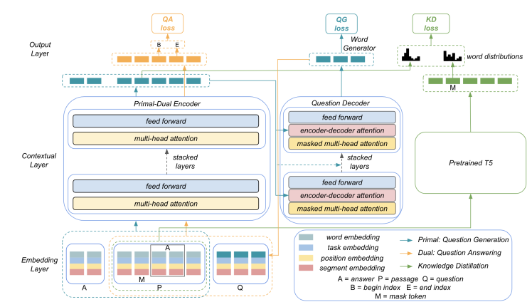
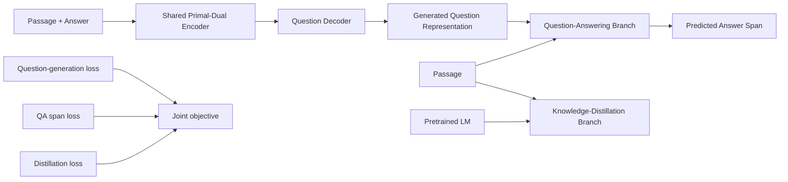

# Primal-Dual Question Generation with Uncommon-Word Distillation

A course-project implementation of **answer-aware automatic question generation** on SQuAD, inspired by Wang et al., *Learning to Generate Question by Asking Question: A Primal-Dual Approach with Uncommon Word Generation* (EMNLP 2022).

The model combines three objectives:

1. **Question Generation (QG)** — generate a question from a passage and target answer.
2. **Question Answering (QA)** — ask the generated question back on the passage and recover the target answer span.
3. **Uncommon-Word / Knowledge-Distillation (KD)** — regularize the shared encoder toward a pretrained language model to improve generalization.

> **Repository status:** the original class submission is preserved under `legacy/`. The root training/evaluation scripts are a corrected cleanup of that submission. I have not re-run the full multi-epoch experiment after these corrections, so the repository intentionally does **not** claim a new corrected BLEU score.

## Why this project is interesting

Most question-generation systems optimize only the likelihood of the reference question. The primal-dual idea adds a second test: **if the generated question is asked on the passage, does it lead back to the intended answer?** This creates a feedback path between generation and answerability rather than treating them as independent tasks.

The project also explores a third objective for uncommon-word generation through knowledge distillation.

## Architecture



The architecture shown above is the diagram from the original project report.

### High-level data flow



The training objective follows the original project design:

```text
L_total = L_QG + alpha * L_QA + beta * L_KD
alpha = 0.8
beta  = 0.15
```

## Important correction: gold-question leakage

The final report correctly noted a late-discovered data-leakage problem in the QA branch. In the submitted code, the QA input was constructed directly from:

```text
passage + ground-truth question
```

That breaks the core primal-dual idea: the QA branch is supposed to consume the **question produced by the QG branch**, so that QA loss can provide feedback about whether the generated question recovers the intended answer.

The corrected implementation in this repository now:

- embeds only the **passage** as the explicit QA input,
- appends the **question-decoder hidden representation** produced by the QG branch,
- restricts answer-span prediction to passage positions,
- allows one-token answers by permitting `end == start`, and
- maps SQuAD character answer spans to tokens with tokenizer offset mappings.

This removes the direct ground-truth-question path from the QA branch and restores the intended connection between the primal QG task and the dual QA task.

## Additional correctness fixes

While restoring the project, I found a second issue that affects the historical evaluation:

- the original evaluation script loaded the checkpoint file with `torch.load(...)` but **never loaded `checkpoint['model_param']` into the model**.

The cleaned evaluation script now calls `model.load_state_dict(...)` before generation.

It also fixes:

- non-cumulative beam-search scoring,
- an inclusive random-index bug in sample selection,
- padding tokens contributing to QG cross-entropy loss,
- fragile character-to-token answer-span conversion, and
- a hard-coded CHPC checkpoint path.

See [`docs/IMPLEMENTATION_NOTES.md`](docs/IMPLEMENTATION_NOTES.md) for details.

## Historical result

The original report recorded a BLEU score of **1.275913**, compared with **19.07** reported for the referenced method. That number is retained only as a **historical class-submission result**. Because the submitted evaluation code did not restore the trained checkpoint and the QA branch used the gold question, I do not present that number as a valid evaluation of the corrected implementation.

A proper corrected experiment would require retraining the model and reevaluating from the saved best checkpoint.

## Repository layout

```text
.
├── QuestionAnsweringTraining.py
├── SampleQsGenerationExampleAndBLEUScore.py
├── requirements.txt
├── docs/
│   ├── architecture.png
│   ├── IMPLEMENTATION_NOTES.md
│   └── NLP_Project_Final_Report.pdf
├── notebooks/
│   └── QuestionAnsweringProject.ipynb
├── artifacts/
│   └── logs/
│       ├── TrainingOutput.txt
│       └── GeneratingExampleSentenceOutput.txt
└── legacy/
    ├── QuestionAnsweringTraining_original.py
    └── SampleQsGenerationExampleAndBLEUScore_original.py
```

The `legacy/` directory keeps the submitted scripts unchanged so the evolution from the class project to the corrected portfolio version is transparent.

## Dataset and model

- **Dataset:** SQuAD
- **Base model:** `facebook/bart-base`
- **Framework:** PyTorch + Hugging Face Transformers/Datasets
- **Evaluation metric used in the class submission:** BLEU via SacreBLEU
- **Random seed:** 66

## Setup

Create a virtual environment and install dependencies:

```bash
python -m venv .venv
source .venv/bin/activate
python -m pip install --upgrade pip
python -m pip install -r requirements.txt
```

The first run downloads SQuAD and `facebook/bart-base` from Hugging Face.

## Training

```bash
python QuestionAnsweringTraining.py
```

The cleaned script saves the best checkpoint under:

```text
checkpoints/QwithKD1.pth
```

The original experiment used:

```text
batch size = 32
epochs     = 9
learning rate = 3e-5
alpha      = 0.8
beta       = 0.15
```

Training the full model is GPU-intensive.

## Evaluation / sample generation

After training (or after placing a compatible checkpoint at `checkpoints/QwithKD1.pth`):

```bash
python SampleQsGenerationExampleAndBLEUScore.py
```

The evaluation script now restores the saved model parameters before generation and uses cumulative log-probability in beam search.

## Original submission materials

- [`docs/NLP_Project_Final_Report.pdf`](docs/NLP_Project_Final_Report.pdf) — final class report
- [`notebooks/QuestionAnsweringProject.ipynb`](notebooks/QuestionAnsweringProject.ipynb) — original explanatory notebook
- [`artifacts/logs/TrainingOutput.txt`](artifacts/logs/TrainingOutput.txt) — historical training log
- [`artifacts/logs/GeneratingExampleSentenceOutput.txt`](artifacts/logs/GeneratingExampleSentenceOutput.txt) — historical sample generations
- [`legacy/`](legacy/) — untouched submitted Python scripts

## Reference

This project was inspired by:

> Qifan Wang, Li Yang, Xiaojun Quan, Fuli Feng, Dongfang Liu, Zenglin Xu, Sinong Wang, and Hao Ma. **Learning to Generate Question by Asking Question: A Primal-Dual Approach with Uncommon Word Generation.** EMNLP 2022, pp. 46–61.

ACL Anthology: https://aclanthology.org/2022.emnlp-main.4/

## Scope

This is an educational research implementation, not an official reproduction of the EMNLP paper. The architecture adapts pretrained BART components and differs from the paper in several implementation details. The repository is preserved to show the modeling ideas, debugging process, and lessons learned from implementing a multi-objective NLP system.
